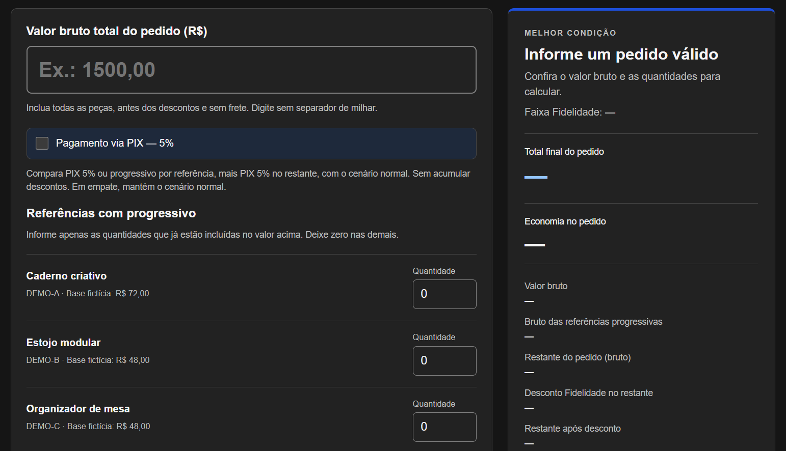

<div align="center">

# Commercial Pricing Calculator

**Static pricing simulator that compares loyalty discounts, progressive pricing, and PIX scenarios to identify the highest customer savings.**

<p>
  
  
  
  
  
</p>

</div>

---

## 🚀 Overview

This project is a static commercial pricing simulator built to compare multiple discount scenarios and automatically select the option that provides the highest customer savings.

The calculator evaluates:

- loyalty discount tiers
- progressive pricing by product reference
- a demonstrative PIX scenario
- the best discount per eligible item
- total savings and final order value by scenario

> [!IMPORTANT]
> All products, SKUs, prices, discount tiers, and commercial conditions used in this repository are **synthetic and adapted for portfolio purposes**.
>
> They do not represent real offers, company policies, or official payment rules.

---

## 🖥️ Demo Preview

<p align="center">
  
</p>

The interface compares loyalty, progressive pricing, and PIX scenarios and automatically highlights the option with the highest customer savings.

The demo supports light and dark themes and runs entirely in the browser.

---

## ✨ Key Features

- automatic comparison between pricing scenarios
- loyalty discount tiers based on gross order value
- progressive pricing by product reference
- demonstrative PIX comparison
- no discount stacking on the same unit
- deterministic tie-breaking rules
- detailed savings breakdown
- responsive interface
- light and dark themes
- keyboard-friendly interaction
- client-side execution only

---

## 🧮 Pricing Logic

The public demo uses synthetic products and pricing rules:

| SKU | Demo Product | Base Price | 4+ Units | 8+ Units |
|---|---|---:|---:|---:|
| DEMO-A | Creative Notebook | R$ 72.00 | R$ 66.00 | R$ 60.00 |
| DEMO-B | Modular Pencil Case | R$ 48.00 | R$ 45.00 | R$ 42.00 |
| DEMO-C | Desk Organizer | R$ 48.00 | R$ 45.00 | R$ 42.00 |
| DEMO-D | Notepad | R$ 32.00 | R$ 30.00 | R$ 28.00 |

### Loyalty tiers

| Gross Order Value | Discount |
|---|---:|
| Below R$ 1,500 | 0% |
| From R$ 1,500 | 5% |
| From R$ 3,000 | 10% |
| From R$ 5,000 | 18% |

### Normal Scenario

For each eligible product reference, the pricing engine compares:

- loyalty discount
- progressive pricing

and applies whichever produces the greater benefit.

The remaining order value receives the loyalty discount.

### PIX Scenario

For each eligible reference:

- progressive pricing is applied when it provides more savings than the demonstrative **5% PIX discount**
- otherwise, the PIX discount is applied

The remaining eligible order value also receives the PIX discount.

> Discounts are never stacked on the same unit.

---

## ✅ Example

Gross order value:

```text
R$ 1,000.00
```

Order:

```text
4 × DEMO-A
```

PIX comparison enabled.

| Component | Savings |
|---|---:|
| Progressive pricing on DEMO-A | R$ 24.00 |
| PIX discount on remaining R$ 712.00 | R$ 35.60 |
| **Total PIX savings** | **R$ 59.60** |
| **Final PIX total** | **R$ 940.40** |

Normal scenario:

```text
Savings: R$ 24.00
Final total: R$ 976.00
```

Result:

**PIX scenario wins.**

---

## 🏗️ Architecture

The application is fully static and runs entirely in the browser.

```text
User Input
    │
    ▼
app.js
    │
    ▼
calculator.js
    │
    ├── Pricing Rules
    ├── Scenario Comparison
    ├── Validation
    └── Rounding Logic
    │
    ▼
Calculated Result
    │
    ▼
DOM Rendering
```

### Main files

```text
calculator.js   Independent pricing engine
app.js          Form handling and UI integration
theme.js        Light/dark theme preference
rules.js        Synthetic catalog and pricing rules
```

The pricing engine is separated from the DOM, allowing the business rules to be tested independently from the user interface.

---

## 🔒 Privacy & Data Handling

The calculator does not use:

- backend services
- databases
- analytics
- customer accounts
- commercial APIs
- persistent order storage

Order data remains in memory and is discarded when the page reloads.

The only persisted information is the user's visual theme preference.

No real commercial data is included in the repository.

---

## 🧪 Testing

The project includes calculation tests, audit tests, and browser-based UI tests.

### Calculation tests

```bash
node tests/calculator.test.cjs
node tests/audit.test.cjs
```

The test suites cover:

- invalid inputs
- discount tier boundaries
- progressive pricing
- PIX enabled and disabled
- tie-breaking behavior
- total conservation
- independent calculation comparison

### UI tests

With Node.js and Microsoft Edge installed:

```bash
npm install
npm test
```

Playwright validates:

- calculation results
- validation errors and recovery
- keyboard interaction
- theme persistence
- responsive behavior
- absence of horizontal scrolling

Tested viewport widths include:

```text
1440px
390px
320px
```

in both light and dark themes.

---

## 🐳 Docker

The application can also be served locally using Docker and Nginx.

```bash
docker compose up --build -d
```

Open:

```text
http://localhost:8081
```

Stop the environment with:

```bash
docker compose down
```

Docker serves the same static application files without requiring a separate build process.

> Docker execution has not yet been validated in the current test environment.

---

## ▶️ Running Locally

Because the application is static, you can also open:

```text
index.html
```

directly in a browser.

For the complete test environment, use the Node.js or Docker instructions above.

---

## ⚠️ Limitations

This project is a portfolio demonstration and not a production commercial pricing engine.

It does not include:

- real product catalogs
- official pricing policies
- real payment conditions
- backend validation
- authentication
- persistent orders
- production analytics
- commercial integrations

There is currently no automated CI workflow configured.

---

## 📄 License

This project is licensed under the [MIT License](LICENSE).
